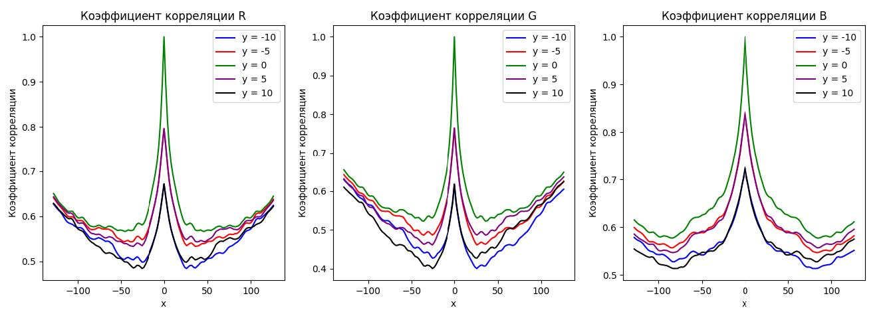
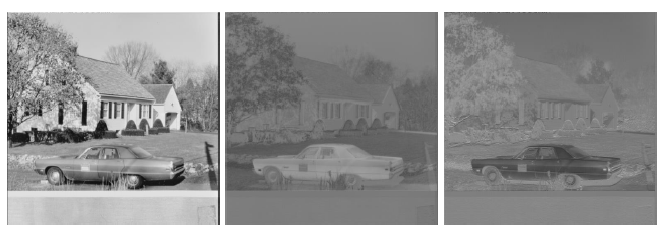
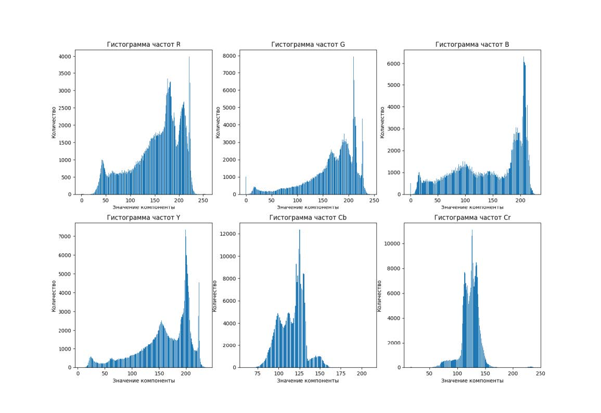

# Статистический анализ BMP-изображений

Лабораторный проект - консольный инструмент на Kotlin для низкоуровневого анализа и преобразования 24-битных BMP-файлов.

## Скриншоты

    
     
    <b>Оценки нормированной автокорреляционной функции</b>
     
     
    
     
    <b>Выделение содержимого компонент Y, Cb и Cr</b>
     
     
    
     
    <b>Гистограммы частот для компонент</b>

### О проекте

Это лабораторная работа для курса "Методы и средства обработки изображений". Главной целью было реализовать классические алгоритмы анализа изображений с нуля, без использования готовых библиотек. Вся работа ведется напрямую с байтовой структурой файла.

### Ключевые возможности

* **Парсинг BMP:** Чтение и разбор заголовков (`BITMAPFILEHEADER`, `BITMAPINFOHEADER`) и пиксельных данных 24-битных BMP-файлов.
* **Разделение на каналы:** Извлечение отдельных цветовых компонент (R, G, B).
* **Конвертация цветовых пространств:** Преобразование изображения из RGB в YCbCr и обратно.
* **Статистический анализ:**
    * Построение гистограмм для каждой компоненты.
    * Расчет коэффициентов корреляции между каналами.
    * Вычисление пикового отношения сигнала к шуму (PSNR).
    * Расчет энтропии для оценки избыточности данных.
* **Децимация:** Реализация алгоритмов прореживания (децимации) цветоразностных компонент (Cb, Cr) для имитации сжатия.
* **Разностное кодирование (DPCM):** Анализ эффективности DPCM с разными предикторами (сосед слева, сверху и т.д.) для уменьшения энтропии.

### Технологический стек

* **Язык:** Kotlin
* **Основная идея:** Работа напрямую с массивами байтов, без сторонних библиотек для обработки изображений. Вся математика и логика реализованы вручную.

### Ключевые выводы из анализа

В ходе работы были получены следующие практические результаты, подтверждающие классические подходы к обработке изображений:

* **Избыточность RGB:** Анализ показал, что компоненты R, G и B в формате RGB24 сильно коррелируют между собой. Это делает формат избыточным с точки зрения хранения данных.
* **Преимущества YCbCr:** Преобразование в цветовое пространство YCbCr эффективно решает проблему избыточности. Компоненты цветности (Cb и Cr) имеют значительно меньший диапазон значений и, как следствие, более низкую энтропию, чем исходные RGB каналы. Это подтверждает, что основная визуальная информация сосредоточена в яркостной компоненте (Y).
* **Эффективность децимации (прореживания):** Были реализованы и сравнены два метода прореживания цветоразностных компонент: простое исключение отсчетов и усреднение. Сравнение по метрике PSNR (пиковое отношение сигнала к шуму) однозначно показало, что усреднение дает значительно более качественный результат при восстановлении изображения.
* **Польза разностного кодирования (DPCM):** Применение DPCM ко всем компонентам (как в RGB, так и в YCbCr) показало, что оценка энтропии значительно уменьшается по сравнению с исходными данными. Это доказывает, что разностное кодирование является эффективным первым шагом для алгоритмов сжатия данных.

### Как запустить

Проект представляет собой консольное приложение.
1. Склонируйте репозиторий.
2. Откройте проект `DIP_LR1_kotlin` в IntelliJ IDEA.
3. Измените имя файла в `Main.kt` на одно из доступных изображений.
4. Запустите `main()` функцию. Результаты анализа (CSV-файлы с данными для гистограмм и корреляций) будут сохранены в соответствующих папках. На основе этих файлов можно построить графики в `DIP_LR1_plots`.