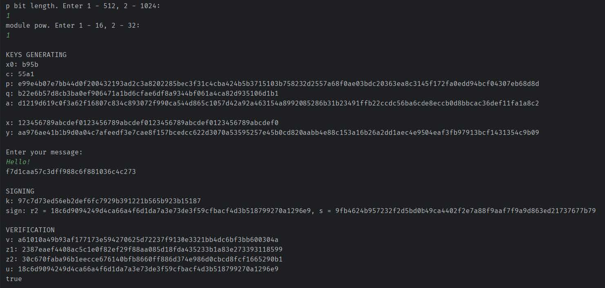
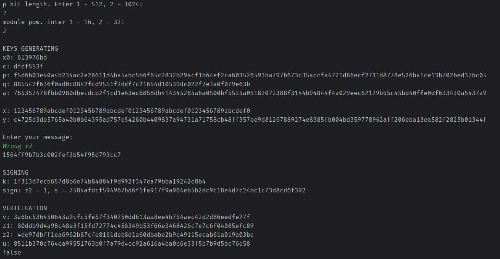

# Реализация алгоритма ЭЦП ГОСТ Р 34.10-94

Лабораторный проект по курсу "Криптографические методы защиты информации". Цель работы - полная реализация стандарта электронной цифровой подписи ГОСТ Р 34.10-94.

В качестве хеш-функции также был реализован алгоритм MD4. Проект выполнен на двух разных технологических стеках.

## Скриншоты

    
     
    <b>Результат работы программы</b>
     
     
    
     
    <b>Результат работы программы</b>

### Описание работы

Программа представляет собой консольное приложение, которое выполняет три основные функции стандарта:

* Генерацию параметров и ключей (открытого и закрытого).
* Создание электронной цифровой подписи для сообщения.
* Проверку подлинности подписи.

Ограничения:

* При постановке подписи использовать самостоятельно реализованную хеш-функцию MD4.
* Алгоритмически важные элементы, такие как тесты простоты, расширенный алгоритм Евклида, быстрое возведение в степень, нахождение первообразного корня, нахождение мультипликативного обратного по модулю и т.д должны быть реализованы самостоятельно.
* В системе должна быть реализована возможность выбора длины ключа шифрования.
* Ключи в системе должны генерироваться автоматически: случайным образом или по паролю.
* В работе можно использовать готовые реализации библиотеки больших чисел (числа больше, чем long int).

### Реализации

#### 1. Версия на Kotlin

**[Ссылка на код](./CryptoLR5_kotlin/)**

Первая версия написана на Kotlin с использованием класса `BigInteger` из стандартной библиотеки Java для работы с длинной арифметикой.

#### 2. Версия на C++

**[Ссылка на код](./CryptoLR5_cxx/)**

Вторая версия реализована на C++.

### Технологический стек

* Kotlin, Java (BigInteger)
* C++, Boost
* CMake (для сборки C++ проекта)

### Выводы из работы

В ходе реализации были сделаны следующие выводы:

* **Назначение ЭЦП:** Электронная цифровая подпись эффективно защищает передаваемые сообщения от подделки или искажения и позволяет однозначно подтвердить личность отправителя.

* **Актуальность стандарта:** Стандарт ГОСТ Р 34.10-94 на данный момент является устаревшим. На смену ему пришел ГОСТ 34.10-2018, основанный на эллиптических кривых. Новый стандарт позволяет достичь того же уровня криптостойкости при значительно меньшем размере ключей.

* **Анализ MD4:** Реализованный алгоритм MD4, хоть и является основой для многих современных хеш-функций, больше не рекомендуется для использования. Причина - найденные уязвимости (коллизии можно найти всего за 220 операций), что делает его неустойчивым к современным атакам. Его усиленная версия, MD5, также со временем показала свою уязвимость.

### Как запустить

**Версия на Kotlin:**

1. Открыть проект в IntelliJ IDEA.
2. Запустить `main()` функцию.

**Версия на C++:**

1. Открыть проект в IDE с поддержкой CMake (например, CLion, Visual Studio).
2. Собрать и запустить проект.