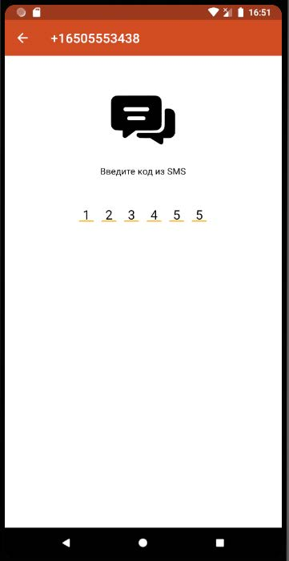
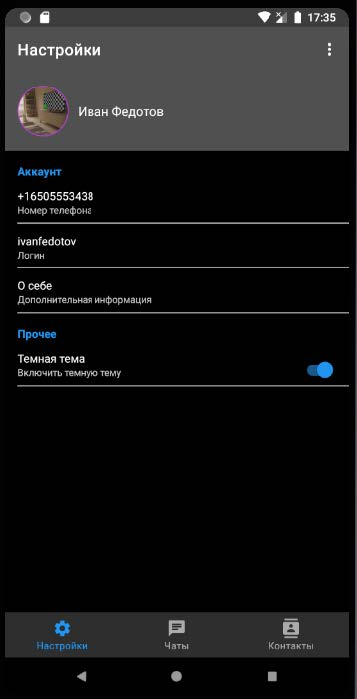
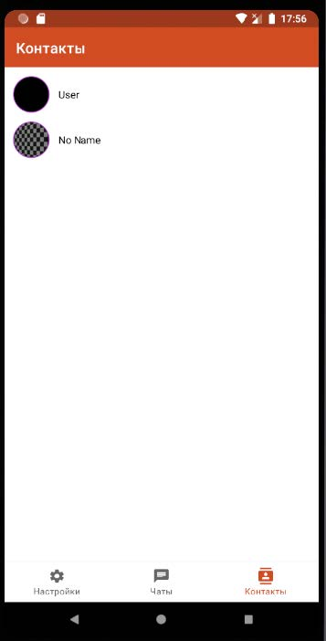
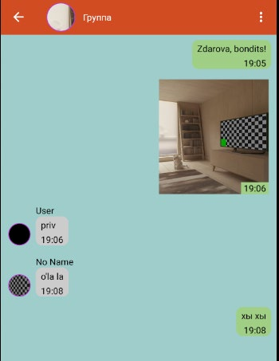

# Мобильный мессенджер "Mesagisto"

Мессенджер для Android, написанный на Kotlin с использованием Firebase в качестве бэкенда. Первый проект, с которого я начал знакомиться с разработкой Android-приложений.

## Скриншоты

<table align="center">
  <tr>
    <td align="center" valign="top">
      
       
      <b>Ввод проверочного кода</b>
    </td>
    <td align="center" valign="top">
      
       
      <b>Экран настроек с включенной темной темой</b>
    </td>
    <td align="center" valign="top">
      
       
      <b>Экран с импортированными контактами</b>
    </td>
    <td align="center" valign="top">
      
       
      <b>Сообщения в группе</b>
    </td>
  </tr>
</table>

### О проекте

Это мой дипломный проект, целью которого было создание мобильного мессенджера на нативном Android. В качестве бэкенда и хранилища я использовал сервисы Firebase (Realtime Database, Storage, Authentication).

Интерфейс построен с использованием XML-верстки.

### Ключевые возможности

* **Регистрация по номеру телефона** с подтверждением по СМС.
* **Обмен текстовыми, аудио- и видео-сообщениями** в реальном времени.
* **Отправка изображений** с загрузкой в Firebase Storage.
* **Групповые чаты.**
* **Список контактов** и поиск пользователей в системе.
* **Редактирование профиля** пользователя (имя, аватар).
* **Темная тема.**
* **Перевод на несколько языков.**

### Технологический стек

* **Язык:** Kotlin
* **UI:** Android SDK, XML Layouts, RecyclerView
* **База данных:** Firebase Realtime Database
* **Хранилище:** Firebase Storage
* **Аутентификация:** Firebase Authentication (Номер телефона)

### Архитектурные решения

* **Firebase:** Firebase был выбран, чтобы сосредоточиться на клиентской части и логике самого приложения.
* **Аутентификация по СМС:** Реализовал полную цепочку аутентификации через Firebase Authentication, включая отправку кода, его верификацию и создание сессии пользователя.
* **Классический UI:** Пользовательский интерфейс построен на XML с использованием `RecyclerView` для отображения списков (чаты, контакты, сообщения).
