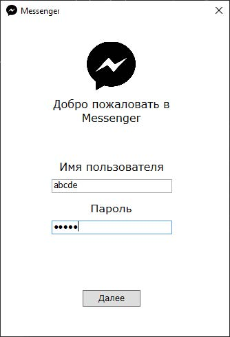
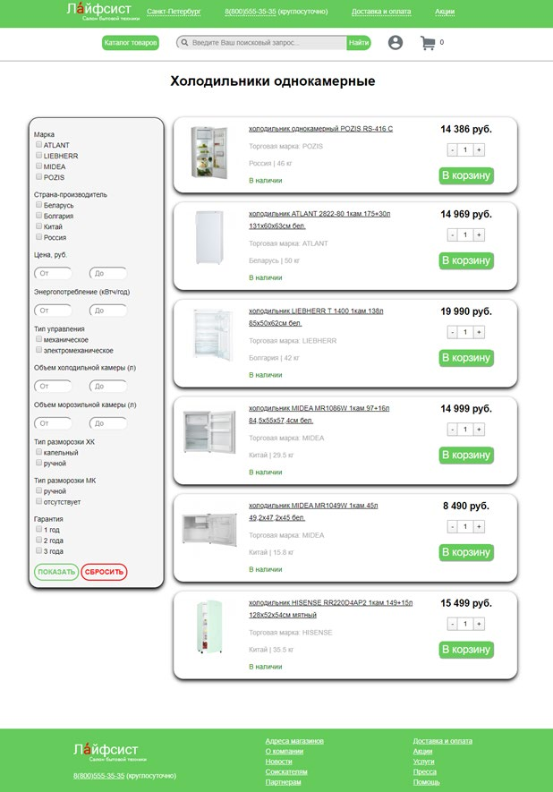

# Дополнительные учебные проекты

Здесь собраны мои лабораторные и курсовые работы, выполненные в разные годы обучения. Они показывают мой опыт в различных технологиях и областях программирования.

### 1. Десктопный мессенджер на C# (WPF)

Это настольное клиент-серверное приложение для обмена сообщениями.

    
Нажмите, чтобы увидеть скриншоты

     
    

        
         
        <b>Окно чата с пользователем test</b>
         
         
        
         
        <b>Стартовое окно авторизации и регистрации, авторизация зарегистрированного пользователя</b>
         
         
        
         
        <b>Отправка письма на указанную электронную почту и появление поля для подтверждения</b>
    

 

* **Стек:** C#, WPF, FireSharp.
* **Ключевые возможности:**
    * Авторизация и регистрация пользователей.
    * Обмен текстовыми сообщениями в реальном времени.
    * Поиск пользователей в системе.
    * Редактирование профиля (никнейм, аватар, пароль).

**[Посмотреть код](./csharp-messenger/)**

### 2. Графический редактор на C# (WinForms)

Простой графический редактор, похожий на Paint, созданный в рамках изучения возможностей C#.

    
Нажмите, чтобы увидеть скриншоты

     
    

        
         
        <b>Рисунок</b>
         
         
        
         
        <b>Форма с 5 последними изменениями</b>
         
         
        
         
        <b>Форма с инструментами</b>
    

 

* **Стек:** C#, WinForms.
* **Ключевые возможности:**
    * Рисование примитивов (линия, эллипс, прямоугольник).
    * Добавление текста и изображений.
    * Ластик для стирания областей и работа с логами действий.

**[Посмотреть код](./csharp-paint/)**

### 3. ИС "Служба занятости" (C# WPF + MySQL)

Классическое десктопное приложение для службы занятости, разработанное как курсовой проект.

    
Нажмите, чтобы увидеть скриншоты

     
    

        
         
        <b>Поиск вакансий с помощью фильтров</b>
         
         
        
         
        <b>Информация о соискателе в профиле</b>
         
         
        
         
        <b>Форма авторизации в системе</b>
    

 

* **Стек:** C#, WPF, MySQL.
* **Ключевые возможности:**
    * Разделение ролей (соискатель, организация, администратор).
    * Взаимодействие с базой данных (CRUD-операции).
    * Использование хранимых процедур и триггеров в MySQL.

**[Посмотреть код](./employment-service/)**

### 4. Веб-приложение "Салон бытовой техники" (PHP + JS + MySQL)

Простой, но полнофункциональный сайт интернет-магазина, созданный для изучения основ full-stack веб-разработки.

    
Нажмите, чтобы увидеть скриншоты

     
    

        
         
        <b>Главная страница сайта</b>
         
         
        
         
        <b>Страница «Холодильники однокамерные»</b>
         
         
        
         
        <b>Страница товара с его характеристиками, описанием и отзывами</b>
         
         
        
         
        <b>Блок отзывов о товаре</b>
    

 

* **Стек:** PHP, JavaScript (jQuery), MySQL, HTML/CSS.
* **Ключевые возможности:**
    * Каталог товаров с фильтрацией.
    * Корзина покупок.
    * Регистрация и авторизация пользователей.

**[Посмотреть код](./lifesist.tk/)**

### 5. Обучающее приложение "Астрономия" (Python + Tkinter)

Десктопное приложение для изучения тем и прохождения тестов по астрономии.

    
Нажмите, чтобы увидеть скриншоты

     
    

        
         
        <b>Экран главного меню приложения</b>
         
         
        
         
        <b>Экран теории приложения</b>
         
         
        
         
        <b>Последний вопрос теста по теме</b>
         
         
        
         
        <b>Таблица результатов тестирования с выделенным последним результатом</b>
    

 

* **Стек:** Python, Tkinter.
* **Ключевые возможности:**
    * Динамическая загрузка тем и тестов из текстовых файлов.
    * Система тестирования с подсчетом результатов.
    * Сохранение статистики прохождения в CSV-файл.

**[Посмотреть код](./python-astronomy/)**

### 6. Реализация блочного шифра Twofish (Kotlin)

Низкоуровневая реализация криптоалгоритма Twofish в рамках лабораторной работы. Программа умеет шифровать как текст, так и файлы.

    
Нажмите, чтобы увидеть скриншоты

     
    

        
         
        <b>Результат шифрования текста</b>
         
         
        
         
        <b>Результат дешифрования текста</b>
         
         
        
         
        <b>Исходная картинка</b>
         
         
        
         
        <b>Зашифрованная в режиме CBC картинка</b>
    

 

* **Стек:** Kotlin.
* **Ключевые возможности:**
    * Реализация основных режимов шифрования (ECB, CBC, OFB, CFB).
    * Анализ свойств шифра: распространение ошибок и корреляция.
    * Работа с файлами разных форматов (текст, изображения).

**[Посмотреть код](./twofish/)**