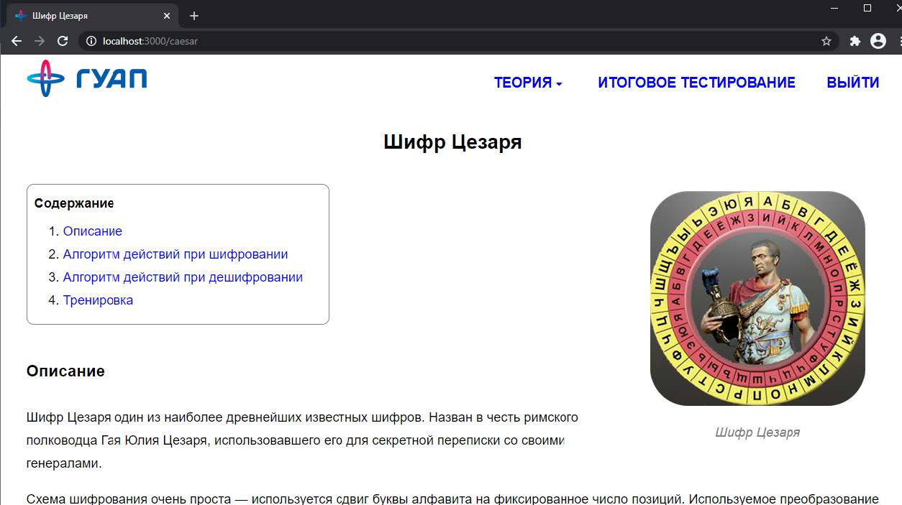
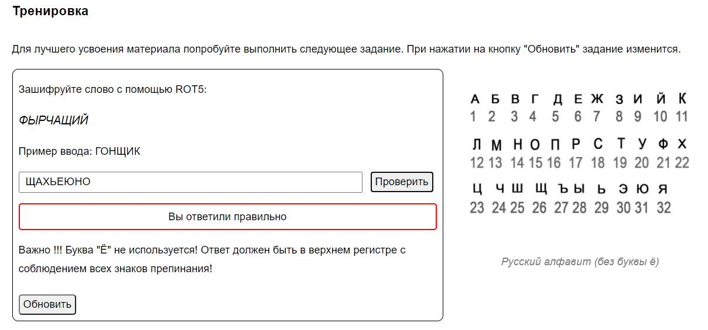
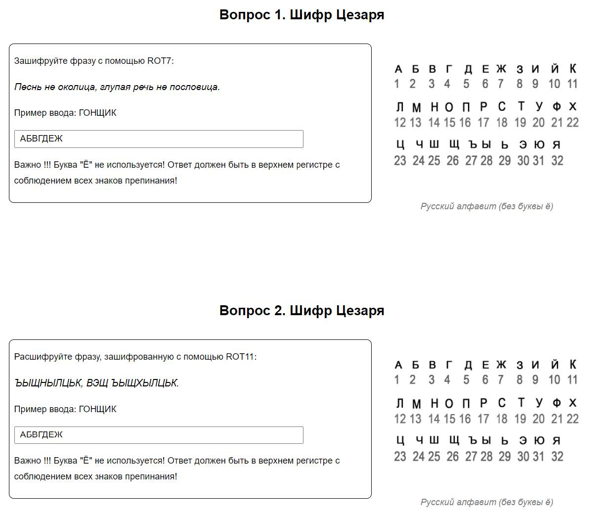
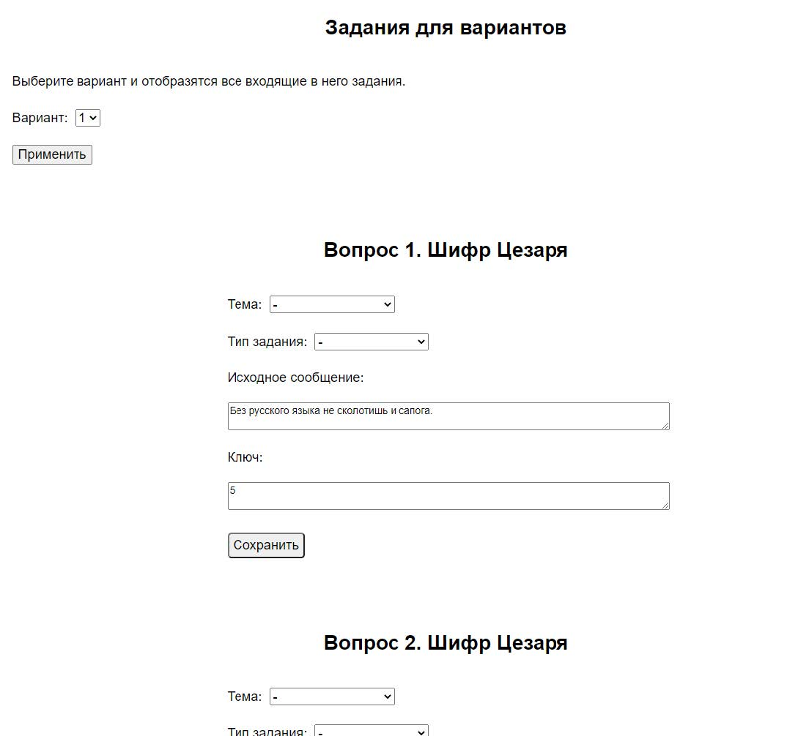
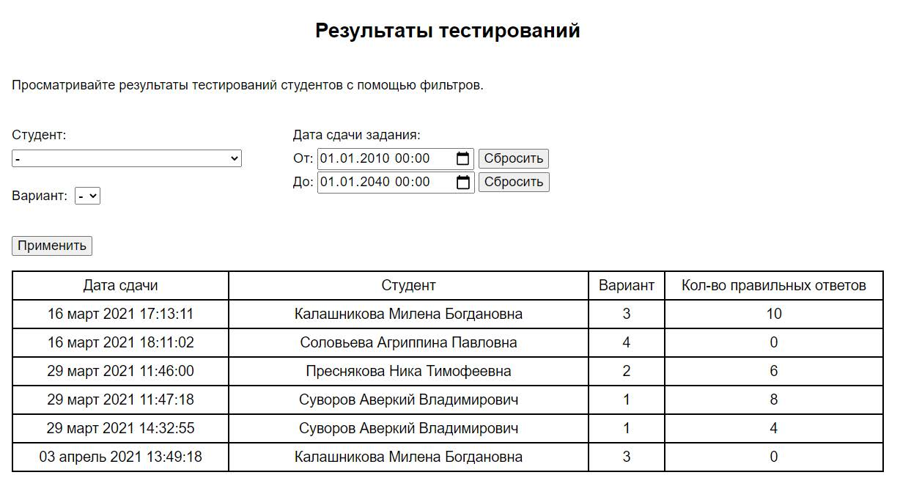

# Учебный сайт "Информационная безопасность"

Интерактивное веб-приложение для обучения и проверки знаний по основам информационной безопасности. Проект был разработан в рамках производственной практики.

## Скриншоты

    
     
    <b>Страница теории по теме "Шифр Цезаря"</b>

 

    
Нажмите, чтобы увидеть остальные скриншоты

    

        
         
        <b>Блок "Тренировка"</b>
         
         
        
         
        <b>Карточки заданий в итоговом тестировании</b>
         
         
        
         
        <b>Страница редактирования заданий для вариантов</b>
         
         
        
         
        <b>Результат поиска в таблице "Результаты тестирований" с помощью фильтров</b>
    

### О проекте

Это образовательная платформа с двумя ролями пользователей: "Студент" и "Преподаватель". Студенты могут изучать теоретические материалы по разным темам (например, "Шифр Цезаря", "Шифр Виженера") и проходить итоговое тестирование. Преподаватели имеют доступ к редактированию тестовых заданий и просмотру результатов всех студентов.

Приложение построено по классической клиент-серверной архитектуре.

### Ключевые возможности

**Для студентов:**

* Регистрация и авторизация.
* Изучение теоретических материалов по разным темам шифрования.
* Интерактивная "тренировка" для закрепления материала.
* Прохождение итогового тестирования по своему варианту.
* Просмотр личных результатов.

**Для преподавателей:**

* Авторизация.
* Просмотр результатов тестирования всех студентов с возможностью фильтрации.
* Редактирование тестовых заданий для каждого варианта.

### Технологический стек

* **Бэкенд:** Node.js
* **База данных:** MySQL
* **Фронтенд:** HTML, CSS, JavaScript (jQuery)
* **Хеширование паролей:** bcrypt

### Технические детали

* **Клиент-серверная архитектура:** Бэкенд на Node.js предоставляет API, через которое фронтенд получает данные и отправляет результаты. Вся логика по работе с пользователями, тестами и результатами находится на сервере.
* **Работа с БД:** Для хранения данных используется реляционная база данных MySQL. Структура включает таблицы для пользователей, тем, вопросов, вариантов и результатов тестирования.
* **Безопасность:** Пароли пользователей не хранятся в открытом виде, а хешируются с использованием `bcrypt`.
* **Динамический интерфейс:** Фронтенд на JavaScript динамически запрашивает данные с сервера (например, список тестов или результаты) и отображает их без перезагрузки страницы.
